🌐 **Taal:** [English](README.md) | [Español](README.es.md) | [Français](README.fr.md) | [Deutsch](README.de.md) | [Português](README.pt.md) | [日本語](README.ja.md) | [简体中文](README.zh-CN.md) | [繁體中文](README.zh-TW.md) | [한국어](README.ko.md) | [العربية](README.ar.md) | [Русский](README.ru.md) | [Italiano](README.it.md) | [Nederlands](README.nl.md) | [Polski](README.pl.md) | [Türkçe](README.tr.md) | [Tiếng Việt](README.vi.md) | [ไทย](README.th.md) | [Bahasa Indonesia](README.id.md)

---

# 🆓 Gratis Crypto Nieuws API

<p align="center">
  <a href="https://github.com/nirholas/free-crypto-news/stargazers"></a>
  <a href="https://github.com/nirholas/free-crypto-news/blob/main/LICENSE"></a>
  <a href="https://github.com/nirholas/free-crypto-news/actions/workflows/ci.yml"></a>
</p>

<p align="center">
  
</p>

> ⭐ **Als je dit nuttig vindt, geef de repository een ster!** Dit helpt anderen het project te ontdekken en motiveert verdere ontwikkeling.

---
Ontvang realtime crypto nieuws van 7 grote bronnen met één API-aanroep.

```bash
curl https://news-crypto.vercel.app/api/news
```
---

| | Free Crypto News | CryptoPanic | Anderen |
|---|---|---|---|
| **Prijs** | 🆓 Altijd gratis | $29-299/maand | Betaald |
| **API Sleutel** | ❌ Niet nodig | Vereist | Vereist |
| **Aanvraaglimiet** | Onbeperkt* | 100-1000/dag | Beperkt |
| **Bronnen** | 12 Engels + 12 internationaal | 1 | Varieert |
| **Internationalisatie** | 🌏 Koreaans, Chinees, Japans, Spaans + vertaling | Nee | Nee |
| **Zelf hosten** | ✅ Eén-klik deploy | Nee | Nee |
| **PWA** | ✅ Installeerbaar | Nee | Nee |
| **MCP** | ✅ Claude + ChatGPT | Nee | Nee |

---

## 🌍 Internationale Nieuwsbronnen

Ontvang crypto nieuws van **12 internationale bronnen** in het Koreaans, Chinees, Japans en Spaans — automatisch vertaald naar het Engels!

### Ondersteunde Bronnen

| Regio | Bronnen |
|--------|---------|
| 🇰🇷 **Korea** | Block Media, TokenPost, CoinDesk Korea |
| 🇨🇳 **China** | 8BTC (Babit), Jinse Finance (Jinse), Odaily (Odaily) |
| 🇯🇵 **Japan** | CoinPost, CoinDesk Japan, Cointelegraph Japan |
| 🇪🇸 **Latijns-Amerika** | Cointelegraph Español, Diario Bitcoin, CriptoNoticias |

### Snelle Voorbeelden

```bash
# Alle internationale nieuws ophalen
curl "https://news-crypto.vercel.app/api/news/international"

# Koreaans nieuws ophalen vertaald naar Engels
curl "https://news-crypto.vercel.app/api/news/international?language=ko&translate=true"

# Nieuws uit Aziatische regio ophalen
curl "https://news-crypto.vercel.app/api/news/international?region=asia&limit=20"
```

### Functies

- ✅ **Automatische vertaling** naar Engels via Groq AI
- ✅ **7-dagen vertaalcache** voor efficiëntie
- ✅ Behoudt **origineel + Engels**
- ✅ **Rate limiting** (1 verzoek/sec) om API's te respecteren
- ✅ **Graceful fallback** voor onbeschikbare bronnen
- ✅ **Deduplicatie** over bronnen

---

## 📱 Progressive Web App (PWA)

Free Crypto News is een **volledig installeerbare PWA** met offline ondersteuning!

### Functies

| Functie | Beschrijving |
|---------|-------------|
| 📲 **Installeerbaar** | Toevoegen aan startscherm op elk apparaat |
| 📴 **Offline Modus** | Lees gecached nieuws zonder netwerk |
| 🔔 **Push Notificaties** | Ontvang breaking news alerts |
| ⚡ **Razendsnel** | Agressieve cachingstrategieën |
| 🔄 **Achtergrond Sync** | Automatisch updaten bij terugkeer online |

### Installeer de App

**Desktop (Chrome/Edge):**
1. Bezoek [news-crypto.vercel.app](https://news-crypto.vercel.app)
2. Klik op het installeer icoon (⊕) in de URL-balk
3. Klik "Installeren"

**iOS Safari:**
1. Bezoek de site in Safari
2. Tik Delen (📤) → "Zet op beginscherm"

**Android Chrome:**
1. Bezoek de site
2. Tik op de installeer banner of Menu → "App installeren"

---

## Bronnen

We aggregeren van **7 betrouwbare media**:

- 🟠 **CoinDesk** — Algemeen crypto nieuws
- 🔵 **The Block** — Institutioneel en onderzoek
- 🟢 **Decrypt** — Web3 en cultuur
- 🟡 **CoinTelegraph** — Mondiaal crypto nieuws
- 🟤 **Bitcoin Magazine** — Bitcoin maximalisten
- 🟣 **Blockworks** — DeFi en institutioneel
- 🔴 **The Defiant** — Native DeFi

---

## Endpoints

| Endpoint | Beschrijving |
|----------|-------------|
| `/api/news` | Laatste nieuws van alle bronnen |
| `/api/search?q=bitcoin` | Zoeken op trefwoord |
| `/api/defi` | DeFi-gerelateerd nieuws |
| `/api/bitcoin` | Bitcoin-gerelateerd nieuws |
| `/api/breaking` | Alleen laatste 2 uur |
| `/api/trending` | Trending onderwerpen met sentiment |
| `/api/analyze` | Nieuws met onderwerpcategorisatie |
| `/api/stats` | Analyses en statistieken |

### 🤖 AI-Powered Endpoints (Gratis via Groq)

| Endpoint | Beschrijving |
|----------|-------------|
| `/api/summarize` | AI-samenvatting van artikelen |
| `/api/ask?q=...` | Stel vragen over crypto nieuws |
| `/api/digest` | AI-gegenereerde dagelijkse digest |
| `/api/sentiment` | Diepgaande sentimentanalyse per artikel |

---

## SDK's en Componenten

| Pakket | Beschrijving |
|---------|-------------|
| [React](sdk/react/) | `<CryptoNews />` plug-and-play component |
| [TypeScript](sdk/typescript/) | Volledige TypeScript SDK |
| [Python](sdk/python/) | Zero-dependency Python client |
| [JavaScript](sdk/javascript/) | Browser en Node.js SDK |
| [Go](sdk/go/) | Go client library |
| [PHP](sdk/php/) | PHP SDK |

**Base URL:** `https://news-crypto.vercel.app`

---

# Zelf Hosten

## Eén-Klik Deploy

[](https://vercel.com/new/clone?repository-url=https%3A%2F%2Fgithub.com%2Fnirholas%2Ffree-crypto-news)

## Handmatig

```bash
git clone https://github.com/nirholas/free-crypto-news.git
cd free-crypto-news
pnpm install
pnpm dev
```

Open http://localhost:3000/api/news

---

# Licentie

MIT © 2025 [nich](https://github.com/nirholas)

---

<p align="center">
  <b>Stop met betalen voor crypto nieuws API's.</b><br>
  <sub>Gemaakt met 💜 voor de community</sub>
</p>

<p align="center">
  <br>
  ⭐ <b>Nuttig gevonden? Geef een ster!</b> ⭐<br>
  <a href="https://github.com/nirholas/free-crypto-news/stargazers">
    
  </a>
</p>
